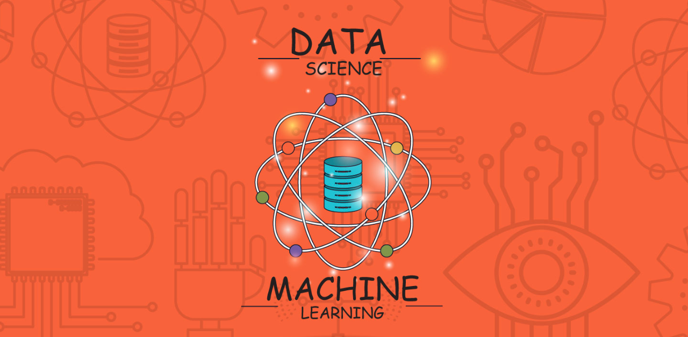
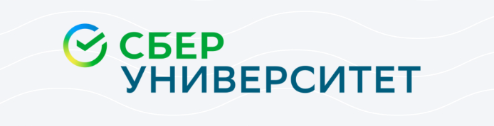

<!--
**AlexeyK12/AlexeyK12** is a ✨ _special_ ✨ repository because its `README.md` (this file) appears on your GitHub profile.

Here are some ideas to get you started:

- 🔭 I’m currently working on ...
- 🌱 I’m currently learning ...
- 👯 I’m looking to collaborate on ...
- 🤔 I’m looking for help with ...
- 💬 Ask me about ...
- 📫 How to reach me: ...
- 😄 Pronouns: ...
- ⚡ Fun fact: ...
-->

|             | Repository   | Content                                                          |
|-------------|-------------|------------------------------------------------------------------|
|| [**PET-projects**](https://github.com/AlexeyK12/PET-projects/blob/main/README.md) | Research projects on data analysis and machine learning |
||[**Diplomas&certificates**](https://github.com/AlexeyK12/Diplomas-and-certificates/blob/main/README.md)|Diplomas, certificates, certificates of courses and hackathons|
||[**Data_scientist-Sberuniversity**](https://github.com/AlexeyK12/Data_scientist-Sberuniversity/blob/main/README.md)|Completed projects and completed materials during training at Sberbank Corporate University|
||[**March_Yandex_2023**](https://github.com/AlexeyK12/Hackathon_Yandex_2023/blob/main/README.md)|Hackathon on BIG Data carried out jointly with a team of designers and project manager|
||[**Data_analyst-Ya.Practicum**](https://github.com/AlexeyK12/Data_analyst-Yandex.Practicum/blob/main/README.md)|Completed projects during the course of training in Yandex.Practicum|
||[**SkolkovoHack-2022**](https://github.com/AlexeyK12/SkolkovoHack-2022/blob/main/README.md)|Intelligent analysis of data warehouse operation based on log processing|

