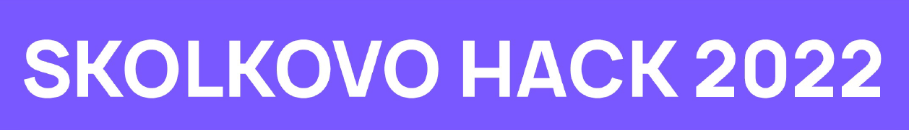

<!--
**AlexeyK12/AlexeyK12** is a ✨ _special_ ✨ repository because its `README.md` (this file) appears on your GitHub profile.

Here are some ideas to get you started:

- 🔭 I’m currently working on ...
- 🌱 I’m currently learning ...
- 👯 I’m looking to collaborate on ...
- 🤔 I’m looking for help with ...
- 💬 Ask me about ...
- 📫 How to reach me: ...
- 😄 Pronouns: ...
- ⚡ Fun fact: ...
-->

|Repository | Content |
|---|---|
|  | Research projects on data analysis and machine learning |
|  | Diplomas, certificates, certificates of courses and hackathons |
|  | GlowByte-Autumn-Hack-2023 |
|  | Completed projects and ready-made materials while studying at Sberbank Corporate University on a refresher course - "Data scientist" |
|  | Hackathon on BIG Data carried out jointly with a team of designers and project manager |
|  | Completed projects during training at Yandex.The workshop on the course of professional retraining - "Data analyst" |
|  | Intelligent analysis of data warehouse operation based on log processing |
|  | GlowByte-Autumn-Hack-2023 |

